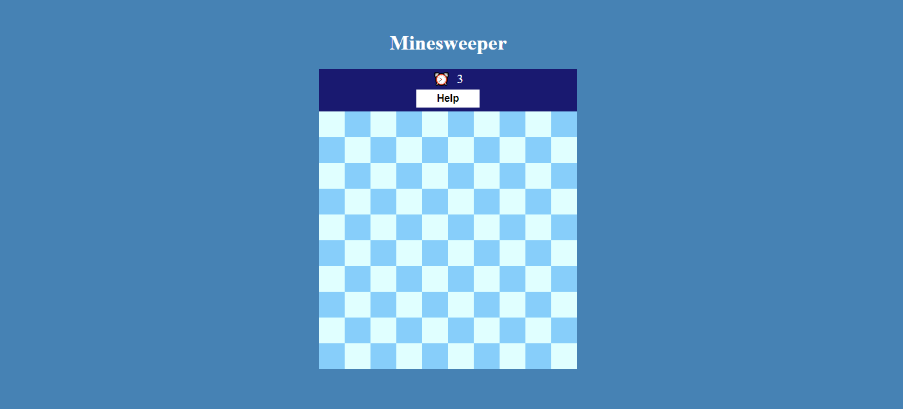
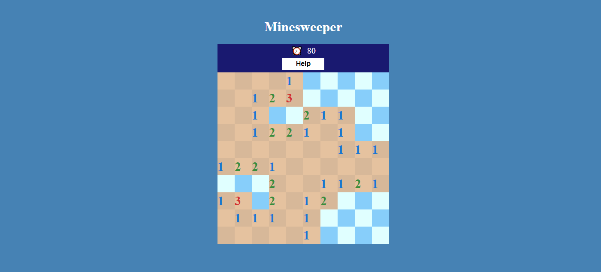
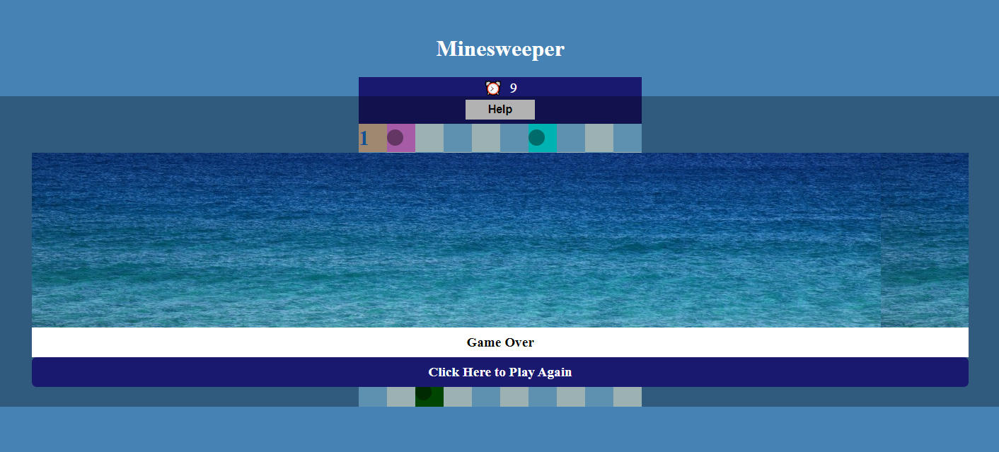

# Minesweeper App

> A React App that allows a user to play Minesweeper.

The deployed app can be found [here](https://sheltered-earth-36448.herokuapp.com/)

## Table of Contents:

- [General Info](#general-information)
- [Installation](#installation)
- [Game Rules](#game-rules)
- [Screenshots](#screenshots)
- [Credits](#credits)
- [Contact](#contact)

## General Information

This is a React app which allows users to play Minesweeper. Minesweeper is a simple
game where a user clicks on tiles to reveal whether there is a "mine" behind the tile
or not. If a tile that hides a "mine" is clicked, the user loses and the game is over.

## Installation

1. On GitHub, navigate to the main page of the repository. Click on the green button "Code". A dropdown menu will be displayed with an option to "Download Zip" - by clicking on this, a zip folder of the react app will be downloaded to your pc.

2. In order to work with the zip files, they must be extracted first.
   Navigate to the downloaded folder and right-click on it.

3. Choose "Extract files".

4. The system will tell you where it is going to send the file and you can change that to where you want to send it.

5. Thereafter, drag the folder to a code editor of your choice. In this example, I will make reference to the VS Code editor.

6. Once VS Code has opened up, click on the view tab on the navigation panel and then click on 'terminal' - This will in turn open up the terminal in VS Code.

7. Use 'cd' to navigate to the project folder. eg cd react-minesweeper-master

8. Install the nodules folder (node dependencies) by entering 'npm install' into the terminal.

9. Once the node dependencies have been installed, you may enter 'npm start' into the terminal - this will run the app in development mode.
   Open [http://localhost:3000](http://localhost:3000) to view the app within the browser.

10. The React App will now run on your local machine.

## Game Rules

1. The purpose of this game is to reveal all the open areas on the board, without hitting any of the bombs.
2. Use the left click button on the mouse to reveal a space on the grid. Keep in mind - if you hit a bomb, you lose.
3. The numbers on the board represent how many bombs are adjacent to a square Eg: if a square has a '2' on it, then there are 2 bombs next to the square.
4. The bombs could be below, above, left, right or diagonal to the square.
5. If you suspect a bomb, use the right mouse click to flag it. Note: There are 15 bombs placed on the board.
6. In order to win the game, avoid all the bombs by flagging it & expose all the empty spaces.

## Screenshots

## Credits

- Minesweeper in 100 minutes - React JS Game [tutorial](https://www.youtube.com/watch?v=BLdd0zP-tAw) - by Edurise.
- HyperionDev - https://www.hyperiondev.com/

## Contact

👤 **Riaz Karolia**

Feel free to contact me on [LinkedIn](https://www.linkedin.com/in/riaz-karolia/)
